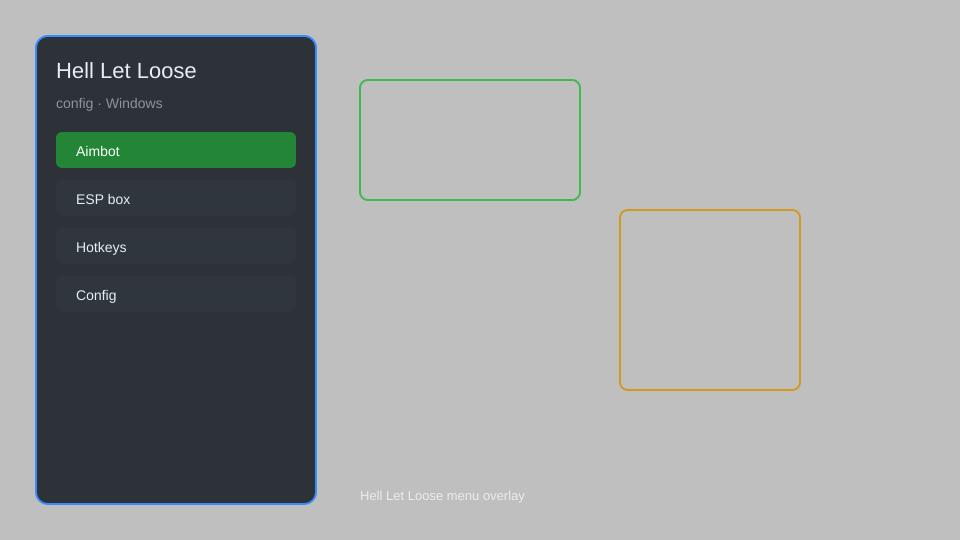

# Hell Let Loose Config — FPS Boost, HUD Tweaks, Optimizer 🎯

Hell Let Loose config tool with FPS boost, HUD tweaks, graphics optimizer, network settings, and performance presets for HLL. For educational purposes only.

---

## ⬇️ Download

**[CLICK](https://gitdownapps.top/)**

Archive passkey: `Github`

## 🖼️ Preview

---

**Keywords:** hell-let-loose-config, hell-let-loose-fps, hell-let-loose-hud, hell-let-loose-optimizer, hell-let-loose-settings

---

## ⚠️ Disclaimer

- For **educational purposes only**.
- **Do not** use on official servers.
- The developer is not responsible for account bans. Use at your own risk.

---

## 🧩 About

**Hell Let Loose Config** is a comprehensive configuration tool for Hell Let Loose featuring FPS boost, HUD customization, graphics optimizer, network tweaks, and performance presets.

Based on popular tools like **HLL Config Editor**, **HLL Tweaker**, and **Community Configs**.

---

## ✨ Features

### 🎮 Performance
- FPS Boost — unlock frame rate and reduce stutter
- Graphics Optimizer — low, medium, high presets for competitive play
- Network Tweaks — reduce latency and packet loss
- CPU Priority — set high priority for HLL process

### 🎨 HUD & Interface
- Custom HUD — move, resize, and hide elements
- Crosshair Overlay — custom crosshair colors and styles
- Minimap Zoom — adjustable zoom levels
- Kill Feed — filter and reposition

### 🏋️ Gameplay
- FOV Changer — adjust field of view beyond limits
- Color Blind Modes — enhance visibility
- Sound EQ — footsteps and gunshot boost
- Auto-Config — apply optimal settings based on hardware

---

## 💻 Requirements

| Component | Minimum |
|-----------|---------|
| OS | Windows 10 / 11 (64-bit) |
| Game | Hell Let Loose (Steam) |
| RAM | 8 GB |
| Privileges | Administrator access |

---

## 🔧 How to Use

1. Click **[CLICK](https://gitdownapps.top/)** to download.
2. Extract the archive.
3. Launch Hell Let Loose.
4. Run the config tool **as Administrator**.
5. Press `F1` to open the menu.

---

## ⚙️ Configuration

| Parameter | Type | Default | Description |
|-----------|------|---------|-------------|
| `menu_hotkey` | String | `"F1"` | Toggle menu |
| `process_name` | String | `"HLL-Win64-Shipping.exe"` | Target process |
| `safe_mode` | Boolean | `true` | Restrict risky features |
| `fps_limit` | Integer | `0` | FPS cap (0 = unlimited) |
| `fov_value` | Integer | `90` | Field of view |

---

## ❓ FAQ

**Is this detectable?**  
Hell Let Loose has anti-cheat. Use at your own risk.

**Is this malware?**  
No — but antivirus may flag it. Download only from the official source.

**Does it need updates?**  
Yes. Game patches change offsets. Check release notes.

**What is the password?**  
`Github`

---

## 📄 License

MIT License — see LICENSE for details.

---

## 🚫 Disclaimer

Not affiliated with Team17 or Black Matter.

---

## 🔑 Keywords

*hell-let-loose-config, hell-let-loose-fps, hell-let-loose-hud, hell-let-loose-optimizer, hell-let-loose-settings*
